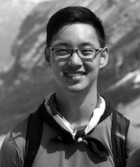

<!--  -->

### About Me

I am an Assistant Professor in the [Department of Computer Science](https://www.cs.rochester.edu/) and the [Goergen Institute of Data Science](https://www.sas.rochester.edu/dsc/) at the University of Rochester. I was previously at the University of Toronto for a postdoc working with [Nisarg Shah](https://www.cs.toronto.edu/~nisarg/index.html). Before that, I completed my PhD degree in the Computer Science Department at Carnegie Mellon University, where I was fortunate to be advised by [Ariel Procaccia](http://procaccia.info/). Even before that, I completed my undergraduate degree in computer science at Harvard College, where I worked with [David Parkes](https://www.eecs.harvard.edu/~parkes/) on dynamic kidney exchange.

### My Research

I work on theoretical problems at the intersection of computer science and economics, particularly in computational social choice, which focuses on designing and evaluating methods of aggregating individual preferences to make collective decisions. 

Recently, I have focused on problems at the intersection of computer science and democracy. Crucially, this interaction is a two-way street: Not only can we use principles from computer science to analyze and design democratic paradigms, but we can also use ideas from democracy to solve difficult problems in computer science. Some projects I have worked on in this space include virtual democracy, liquid democracy, and participatory budgeting.

In general, I am excited about solving real-world problems with a combination of theoretical and empirical tools. Many of my projects incorporate ideas from theoretical computer science, artificial intelligence, and (sometimes) human-computer interaction, and I am always excited to work on new interdisciplinary collaborations.

### Miscellaneous

In my free time, I enjoy playing the piano (recently, including chamber music), doing yoga, reading (lately, not so much...), bouldering, and playing table tennis and ultimate frisbee.

### Contact Information and Quick Links

+ Email: <ansonkahng@gmail.com>
+ [Google Scholar](https://scholar.google.com/citations?user=5q9EqQkAAAAJ&hl=en)
<!-- + Email: <akahng@cs.cmu.edu> -->
<!-- + Office: GHC 6207 -->

